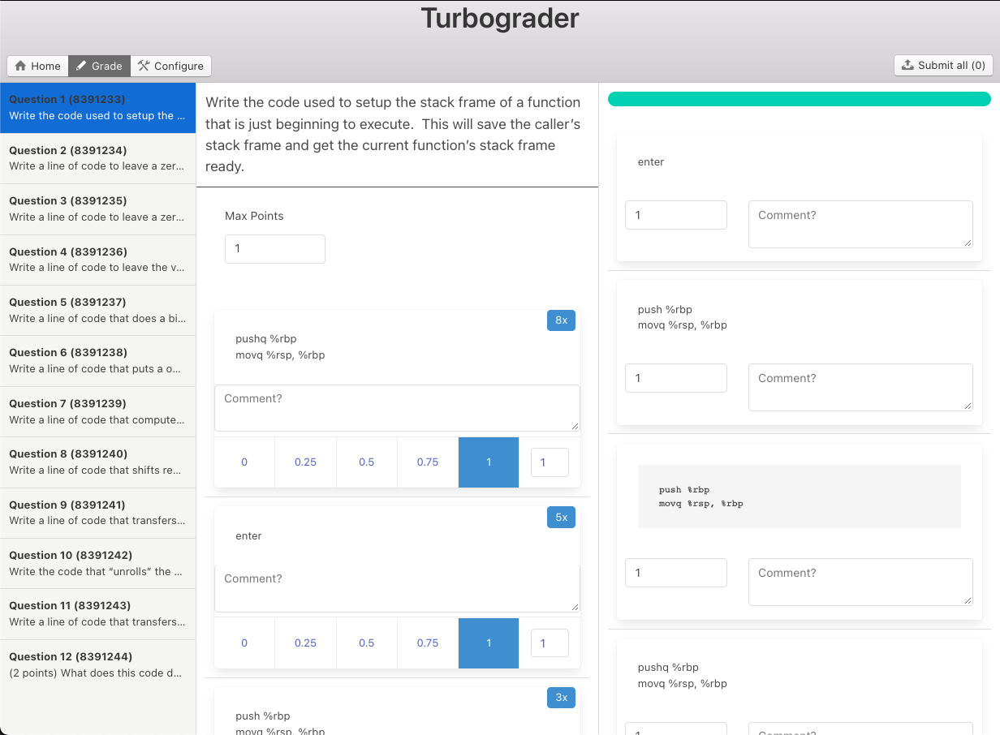

turbograder
=====

This is (regrettably) an Electron app.

The goal is to create a cross-platform UI that can be used by graders / instructors to quickly grade short answer / extended response questions on Canvas quizzes.

You provide a Canvas API key as input, select a course and quiz, and then it will pull all of the quiz repsonses. Unlike in the Canvas web UI, you can grade all responses to each *question* at one time. It will group the quiz responses together so that identical responses are automatically given the same grade (*and* same comment!), and it will allow you to 'pin' responses while you grade so you can give partial credit consistently.

This replaces ugly python scripts I have been using for a while. A web app doesn't cut it here, since I don't want to have to proxy to get around CORS.

Status
----

- [x] Token input
- [x] Course/quiz selection (list from API)
- [x] Pull quiz responses from API
- [x] Grading UX (mostly working)

